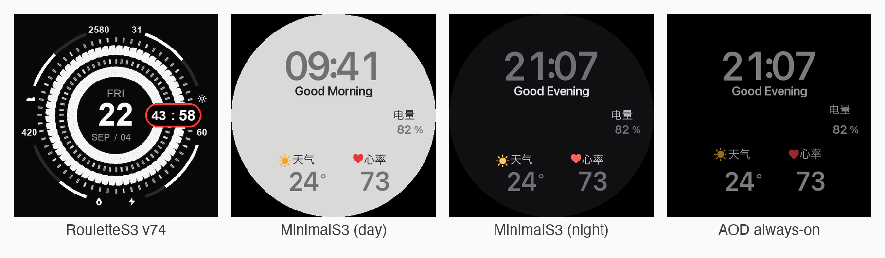

# 小米 Watch S3 自研表盘工程（RouletteS3 / MinimalS3 / daynight）

[English](README.md) | 简体中文

对小米 Watch S3 (M2313W1) 表盘格式（ws3）的逆向分析与自研打包工具链，用于制作带 **平滑扫秒 / AOD 息屏 / 四角圆角进度弧** 的自定义表盘。



## 这是什么

- 目标设备：小米 Watch S3 (M2313W1)，466×466 AMOLED，逻辑画布 464×464，圆心 (232,232)
- 三套成品表盘：
  - **RouletteS3**（轮盘盘）：类 Google Pixel Watch 风格，平滑扫秒 + AOD + 四角圆角进度弧（最新 v74）
  - **MinimalS3**（数字盘）：无指针数字盘，随时间变化的问候语 + 冒号 1Hz 闪烁 + 完美 AOD 过渡（最新 v5_fix）
  - **daynight**（昼夜盘）：随日出日落自动换背景（MinimalS3 的昼夜增强版，对应 MinimalS3_v5_fix）
- 自研 Java 打包器 **Mi8WfBinTool**：从 `wfDef.json` + PNG 素材打包成可安装的 `.bin`

## 特性

- 平滑扫秒（固件亚秒插值，非 1Hz 跳秒）
- AOD 息屏显示（双面盘，黑底灰阶）
- 四角圆角进度弧（步数 / 卡路里 / 电量 / 温度）
- 数字盘：24 帧问候语 + 冒号 1Hz 闪烁（兼容自动换背景）
- 点击热区跳转（天气 / 心率 / 步数 / 闹钟等，prop9）

## 法律与版权声明（务必先读）

- 本项目包含对小米官方表盘二进制的**逆向工程**分析，仅供 **个人学习与研究**。
- `reference/` 下明确标注的第三方官方闭源表盘（`谷歌轮盘·橙.bin`、`寻路者·黄.bin`）**已默认排除出本仓库**（见 `.gitignore`），其版权归原厂商所有，请勿分发。
- 自研打包器 `Mi8WfBinTool` 的逆向经验来源于开源项目 **ooflet/Mi-Create**（MIT），本项目仅用于个人自定义表盘制作。
- **源代码**按 [MIT License](LICENSE) 开源；**成品表盘 `.bin` 及其内嵌美术素材**为个人创作，不在 MIT 许可范围内（保留所有权利）；小米官方固件 / 表盘及相关商标不在许可范围内。
- **请勿将本仓库内容用于任何商业分发。** 由此产生的一切法律责任由使用者自行承担。

## 环境要求

- macOS / Linux（类 Unix）
- JDK（已在 OpenJDK 25 编译验证；`javac` / `java` 在 PATH）
- Python 3 + Pillow：`pip install -r requirements.txt`（纯 PIL，无 numpy）
- 表盘数字/文字素材生成脚本使用 macOS 系统字体（`/System/Library/Fonts/SFNS.ttf`），Linux 需自行替换字体路径
- 一台小米 Watch S3 真机 + 小米运动健康（Mi Fitness）App 用于装机验证（模型无法读屏，一切改动以真机反馈为唯一验收标准）

## 目录结构

```
├── README.md            ← 英文说明（面向人）
├── README.zh-CN.md      ← 本文件
├── AGENTS.md            ← AI 接手指南（工具链 / 已修 bug / 验证清单 / 当前状态）
├── LICENSE              ← MIT（仅源代码；bin/素材除外）
├── docs/
│   └── FORMAT.md        ← ws3 二进制格式逆向参考（表头 / face record / prop7Raw / dataSrc）
├── tools/
│   ├── Mi8WfBinTool/    ← 打包器源码(Java) + build.sh  ← 唯一真源（.class 不入库）
│   └── scripts/         ← patch_header.py / gen_assets_*.py / assemble_*.py
├── project/
│   ├── ws3/             ← 轮盘盘工程源：wfDef.json(含全部 prop7Raw) + images/ + images_aod/
│   ├── build_v64.py …   ← 各版构建/素材重绘脚本
│   ├── minimal/         ← 数字盘工程
│   └── daynight_v5/     ← 昼夜盘工程
├── deliverables/        ← 最新版 .bin + 预览图（历史版本见 GitHub Releases）
└── reference/           ← 官方数据源 JSON + 自研基准盘（第三方官方 bin 已 gitignore）
```

## 快速开始（重新打包轮盘盘 v74）

```bash
# 0. 安装 Python 依赖
pip install -r requirements.txt

# 1. 编译打包器
cd tools/Mi8WfBinTool && bash build.sh && cd ../..

# 2. 打包当前工程源
java -cp tools/Mi8WfBinTool Mi8WfBinTool pack project/ws3 out.bin ws3

# 3. 补表头（平滑开关 byte[6]、标志 0x16、styleCount）
python3 tools/scripts/patch_header.py out.bin 1 4 1

# 4. 解包回读验证（见 AGENTS.md §8 验证清单）
java -cp tools/Mi8WfBinTool Mi8WfBinTool unpack out.bin /tmp/chk ws3

# 5. 装机：把 out.bin 拷到手表 → Mi Fitness → 表盘管理 → 自定义 → 导入
```

> 说明：`project/` 下脚本均以仓库根为基准的相对路径运行（自动向上查找 `tools/`），
> 从任意克隆位置都能执行。数字/昼夜盘的 `gen_assets.py` 需要一张 2048×2048 设计参考图
> （不入库），用环境变量 `WF_REF_IMAGE` 指向本地副本即可。

## 工具链

| 工具 | 作用 |
|---|---|
| `Mi8WfBinTool`（Java） | `pack <dir> <out> ws3` / `unpack <bin> <out> ws3`，逐字段比对两个盘的金标准 |
| `patch_header.py` | 回补 `byte[6]=1`(扫秒开关)、`0x16=1`、`styleCount=4` |
| `gen_assets_*.py` | 用 PIL 生成素材 PNG（轮盘环 / 数字字模 / 弧帧） |
| `assemble_*.py` | 合成 wfDef.json |
| `preview*.py` / `build*.py` | 静态预览与一键流水线 |

## 关键技术结论（想改格式必读）

完整格式参考见 **[docs/FORMAT.md](docs/FORMAT.md)**，细节与调试史在 **AGENTS.md**。定论速览：

- **平滑扫秒真配方**：主元素列表最前两位 `[0]/[1]` 放指针（ds=1811 秒 / 1011 分，prop7Index 12/13）+ 每个 dignum/imagelist 的 **prop7Raw 通道字节**（b6-7=刷新毫秒，必须非零）。
- **AOD 双面盘生死线**：face record `u32@+0 = 0x80000000`（仅 AOD 盘两面置位，1-face 盘保持 0）。
- **dataSrc 合法表**：见 `reference/micreate_sources_official.json`（Mi-Create 官方 76 条）。常见坑：`381202`/`084102` 是旧打包器污染出的非法源，会整 face 跳秒。
- **打包器已修 4 个 bug**：showCount 覆盖 dataSrc 第三字节、styleCount 硬编码 6、AOD face record 缺 0x80000000、spacing 覆写 imagelist b13。改源码前先读 AGENTS.md §4。

## 复用边界

- **同款换肤 / 配色 / 换某张素材** → 直接改 `project/ws3` 重打包（极低成本）。
- **Mi-Create 导出的新 bin 想改细节** → `unpack` 改 `wfDef` 再 `pack`（注意：unpack 会剥掉 prop7Raw，重打包前务必用工程里的 wfDef 兜底）。
- **全新风格表盘（数字 / 指针 / 拟物）** → 复用工具链 + 格式知识，但 wfDef 骨架从头设计（因有逆向结论，远快于从零）。

## 验证清单（出每版必做）

- `byte[6]=1`、`0x10=0x800`、`0x16=1`、`faceCount=2`、`styleCount=4`
- 两个 face record `u32@+0 = 0x80000000`
- 指针签名 `18110030` / `10110030` 各 1 次
- 4 弧元素 x/y=(0,0) 且各 11 帧；体积 < 4MB
- 像素级：亮度 / alpha 阈值取点 → 算 web 角与半径 → 对照预期象限

## 变更历史

见 [CHANGELOG.md](CHANGELOG.md)；历史版本 `.bin` 在 [GitHub Releases](../../releases)。

## 参考与致谢

- [ooflet/Mi-Create](https://github.com/ooflet/Mi-Create)（MIT，逆向起点与 `jump_codes` 来源）
- 小米官方对照表盘（已 gitignore，仅本地用于字段比对）

## License

源代码按 [MIT](LICENSE) 开源。成品表盘 `.bin` 与美术素材**不在** MIT 范围内（保留所有权利）；小米官方固件/表盘及商标归原厂商所有。商业分发请自行评估合规风险。
